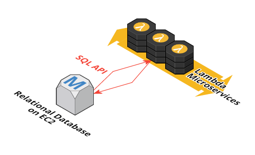
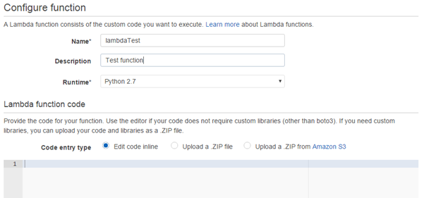
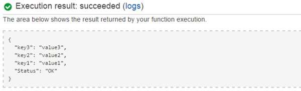
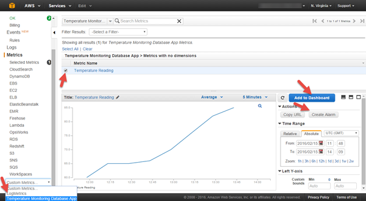
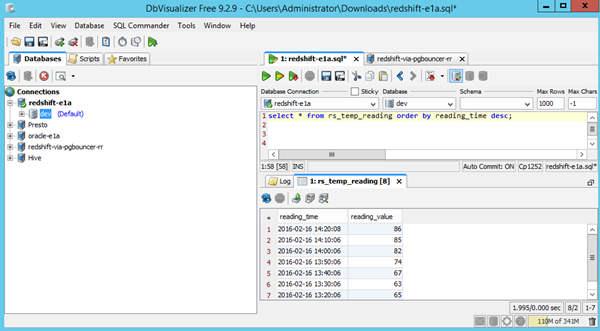
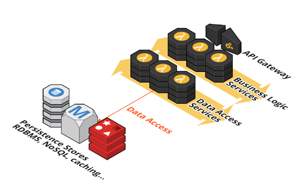

# From SQL to Microservices: Integrating AWS Lambda with Relational Databases 

With a simple internet search, you will quickly find many articles describing the appeal of [Microservices](http://martinfowler.com/articles/microservices.html) architectures, and explaining why [AWS Lambda](https://aws.amazon.com/lambda/) is an excellent microservices compute platform. 
 
Did you know that it may be possible for you to take advantage of this transformational technology from within your existing relational database application?  We will explore how to call Lambda functions from a relational database running on EC2, using SQL user-defined functions.



Here are a few of the reasons why you might find this capability useful:

- **Instrumentation:** Use database triggers to call a Lambda function when important data is changed in the database. Your Lambda function can easily integrate with Amazon Cloudwatch, allowing you to create custom metrics, dashboards and alarms based on changes to your data.

- **Outbound streaming:** Again, use triggers to call Lambda when key data is modified. Your Lambda function can post messages to other AWS services such as Amazon SQS, SNS, SES, or Kinesis Firehose, to send notifications, trigger external workflows, or to push events and data to downstream systems such as an Amazon Redshift data warehouse.

- **Access external data sources:** Call Lambda functions from within your SQL code to retrieve data from external web services, read messages from Amazon Kinesis streams, query data from other databases, and more. 

- **Enable incremental modernization:** Improve agility, scalability, reliability, and eliminate database vendor lock-in by evolving in steps from an existing monolithic database design to a [well-architected](https://aws.amazon.com/blogs/aws/are-you-well-architected/), modern microservices approach. Incrementally migrate business logic embodied in database procedures into database agnostic Lambda functions, while preserving compatibility with remaining SQL packages.

Later on, in [PART 2](#part-2---example-use-cases), we will revisit these scenarios, but first things first. We need to establish the interface that enables SQL code to invoke Lambda functions. 

## PART 1 - Set up SQL-to-Lambda interface

We will create user-defined functions in the database using a programming language that is supported by both the RDBMS and the AWS SDK. The user-defined functions call the AWS SDK to invoke specified Lambda functions, passing parameters and retrieving results in the form of JSON object strings. 
  
These user-defined database functions serve as a flexible interface allowing SQL code running in your database to call microservice functions hosted in AWS Lambda. The Lambda functions embody your business logic, and may be implemented in any of several supported programming languages (currently Javascript, Java, or Python). 
  
I will show you how to set this up for Oracle (using Java) and PostgreSQL (using Python).
_(While untried, it should be possible to implement similar mechanisms in other databases, using, for example, the .NET SDK for SQL Server, the C++ SDK for MySQL, etc.)_

### Create a testing function in Lambda

This is a simple Python function that simply returns a string containing the input JSON parameters.  
Steps:  

1. Sign in to the [AWS Management Console](http://console.aws.amazon.com/) and open the AWS Lambda console.
1. Choose **Create a Lambda function**.
1. On the **Select blueprint** page, click **Skip**.
1. The **Configure Function** page appears.  
  
    
     
1. Enter `lambdaTest` in the **Name** field, and select `Python 2.7` in the **Runtime** field.  
1. Paste the following code into the **Lambda Function Code** field: 

    ```
	def lambda_handler(event, context):
	    output = event
	    output["Status"] = "OK"
	    return output
    ```
1. Assign a **Role** to the function. If you have used AWS Lambda before, you may select an existing role, otherwise select the option to create a new `Basic execution role`.      
1. The value of **Timeout** defaults to 3 seconds, which is fine for this short function. However, when you implement more useful functions later, you must increase the timeout as necessary to give your function plenty of time to execute.  
1. Accept all other defaults and click **Next**, then click **Create Function**.  
1. Test your function from the console by clicking the **Test** button, and verify that it runs with no errors, and that it returns the expected result. 

    
  
### Create IAM EC2 Instance Role

The EC2 instance running your database server needs an associated EC2 Instance Role with an attached policy granting permission to invoke AWS Lambda functions.  
   
1. Open the [AWS Management Console](http://console.aws.amazon.com/) and launch the IAM console.  
1. Create a new **Role**. Set **Role Name** to `rdbms-lambda-access`. Click **Next Step**.  
1. Select **Amazon EC2** role type.  
1. Select policy **AWSLambdaFullAccess**. Click **Next Step**.  
1. Click **Create Role**.  

### Create database on EC2 instance using role

If you already have an Oracle or PostgreSQL server running on EC2, migrate it to a new instance so you can apply the newly created IAM role. You can do this by creating an Amazon Machine Image (AMI) from your existing EC2 instance, and launch a new instance from that AMI.

Or, to create a new database, manually launch a pre-configured Oracle or PostgreSQL AMI from the AWS Marketplace. Or, launch a vanilla Linux image and install the database yourself.

As you launch your new instance, be sure to specify the new IAM role, `rdbms-lambda-access`, in the **Configure Instance Details** page.

Connect to your new instance using ssh, and complete any necessary steps to ensure that your database is running and that you can connect with administrative privileges using the native database client.

The following two sections are database vendor specific. If you are using PostgreSQL, skip to the [PostgreSQL Setup](#postgresql-setup) section below.

### Oracle Setup

#### Step 1: LambdaInvoke java class
  
Oracle supports the use of java methods for user defined functions. The java class below uses the AWS SDK to invoke a named Lambda function (fn_name) in either synchronous (RequestResponse) or asynchronous (Event) mode, passing parameters in the form of a JSON string (fn_args):

```
public class LambdaInvoke {

    public static String invoke_sync(String fn_name, String fn_argsJson) throws Exception {
       return invoke(fn_name, fn_argsJson, "RequestResponse");
    }

    public static String invoke_async(String fn_name, String fn_argsJson) throws Exception {
       return invoke(fn_name, fn_argsJson, "Event");
    }

    private static String invoke(String fn_name, String fn_argsJson, String fn_invocationType) throws Exception {
	String result;
	   AWSLambdaClient client = new AWSLambdaClient();  // default credentials chain will find creds from instance metadata
	   InvokeRequest invokeRequest = new InvokeRequest();
	   invokeRequest.setFunctionName(fn_name);
       invokeRequest.setPayload(fn_argsJson);
	   invokeRequest.setInvocationType(InvocationType.fromValue(fn_invocationType));
	   InvokeResult invokeResult = client.invoke(invokeRequest);
	   ByteBuffer resultBytes = invokeResult.getPayload();
	   result = new String(resultBytes.array()) ;
	   String errType = (invokeResult.getFunctionError()); 
       if (errType != null && !errType.isEmpty()) {
		   throw new Exception(result) ;
	   }
	return result;
    }
}
```

Follow the instructions below to build and install the `LambdaInvoke` class:
  
1. Install **git** and **maven** on the database server instance, if they're not already installed.  
1. As the **oracle** user, download and build the `rdbms-lambda-integ` project from github. Steps:  
   ```
   sudo su - oracle
   git clone https://github.com/awslabs/aws-lambda-rdbms-integration.git
   cd rdbms-lambda-integ/oracle
   mvn clean package
   ```
     
   This builds a self contained jar file containing the `LambdaInvoke` java class and all its dependencies, including the AWS SDK class files.
  
1. Verify that the EC2 instance role is correct and that we can connect to the AWS Lambda service and successfully call our function, using the main method included in the class:
   ```
   java -cp target/aws-rdbmsinteg-1.0.jar com.amazonaws.rdbmsinteg.LambdaInvoke
   ```
   If all is well, the following output will be displayed:
   ``` 
   {"Status": "OK", "name": "bob"}
   ```
  
1. Load the jar file into the Oracle database:
   ```
   loadjava -user system/<password> target/aws-rdbmsinteg-1.0.jar
   ``` 

#### Step 2: User-defined functions

Here is an example Oracle function designed to use the invoke_sync() method of the LambdaInvoke java class to launch a named Lambda function in synchronous mode:
```
CREATE OR REPLACE FUNCTION awslambda_fn(fn_name VARCHAR2, fn_argsJson VARCHAR2) 
    RETURN VARCHAR2
    AS LANGUAGE JAVA
    NAME 'com.amazonaws.rdbmsinteg.LambdaInvoke.invoke_sync(java.lang.String, java.lang.String) return java.lang.String';
```
   

1. Create the `awslambda_fn()` and `awslambda_fn_async()` functions using the script provided:       
   ```
   cat sql/awslambda_ddl.sql | sqlplus system/<password>
   ```

1. Grant required permissions to the SYSTEM user using the script provided:
   ```
   cat sql/permissions.sql | sqlplus system/<password>
   ```

1. Oracle's java keystore must trust the certificate authority (CA) used by the AWS service - by default it is empty. An easy way to fix this problem is to replace the default Oracle java keystore with a populated keystore from a standard java installation, e.g.:
   ```
   cp $ORACLE_HOME/javavm/lib/security/{cacerts,cacerts.orig} 
   cat /usr/lib/jvm/jre-1.7.0-openjdk.x86_64/lib/security/cacerts > $ORACLE_HOME/javavm/lib/security/cacerts
   ```

1. Log into the database, and test the awslambda_fn function, passing the name of our Lambda function and a JSON input parameter string:
   ```
   sqlplus system/<password>
   SQL> SELECT awslambda_fn('lambdaTest','{"name":"bob"}') AS lambdatest FROM DUAL;
   
   LAMBDATEST
   --------------------------------------------------------------------------------
   {"Status": "OK", "name": "bob"}
   ```
   
Success! Using an Oracle SQL select statement we have successfully invoked our test function on AWS Lambda, and retrieved the results.

### PostgreSQL Setup

For PostgreSQL, we will use the PL/Python language to create our user-defined functions, leveraging the AWS Python SDK to launch Lambda functions and retrieve the results.

#### Step 1: Prerequisites

1. Make sure your database EC2 instance has Python and the two AWS SDK modules, **boto** and **boto3**, installed:
   ```
   sudo pip install boto boto3
   python -c "import boto; import boto3; print 'AWS SDK verified OK'"
   ```

1. Download the `rdbms-lambda-integ` project as the postgres user:
   ```
   sudo su - postgres
   git clone https://github.com/awslabs/aws-lambda-rdbms-integration.git
   cd rdbms-lambda-integ/postgresql
   ```
  
#### Step 2: User-defined functions

Here is an example PostgreSQL function showing how the AWS SDK is used to invoke a named Lambda function in synchronous mode:
```
CREATE LANGUAGE plpythonu;
CREATE OR REPLACE FUNCTION awslambda_fn(fn_name text, fn_args text)
    RETURNS text
    AS $$
     import boto3
     import boto.utils
     region=boto.utils.get_instance_identity()['document']['region']
     client=boto3.client('lambda',region)
     response=client.invoke(FunctionName=fn_name,
                            InvocationType='RequestResponse',
                            Payload=fn_args,
                           )
     r = response['Payload'].read()
     if ( 'FunctionError' in response ):
         raise Exception(r)
     return r
   $$ language plpythonu ;
GRANT EXECUTE ON FUNCTION awslambda_fn(text, text) TO PUBLIC;
```
1. Create the awslambda_fn() and awslambda_fn_async() functions using the script provided:    
   ``` 
   psql -U postgres -f sql/awslambda_ddl.sql
   ```

1. Log into the database, and call the awslambda_fn function, passing the name of the test Lambda function and a JSON input parameter string:
   ```
   psql -U postgres
   postgres=# SELECT awslambda_fn('lambdaTest','{"name":"bob"}') AS lambdatest ;  
   
                          lambdatest
   ----------------------------------------------------------
    {"Status": "OK", "name": "bob"}
   (1 row)
   ```  
   
Success! Using a PostgreSQL SQL select statement we have successfully invoked our test function on AWS Lambda, and retrieved the results.

Now, let's explore some interesting use cases for our new Lambda interface.

## PART 2 - Example Use Cases

Now that the mechanics are in place, we can quickly and easily create new Lambda functions to do useful things! Let's revisit some of the use cases identified in the opening section.

  
### Instrumentation - Monitor and Alert with Amazon CloudWatch

Say we have an existing application which uses an Oracle database to track temperature sensor readings. We'll keep our example simple, and assume the readings are stored in a 2-column table, which you should create now:  
```
CREATE TABLE temp_reading (reading_time TIMESTAMP, reading_value NUMERIC);
```

Let's enhance our application by leveraging Amazon CloudWatch to show the temperature readings over time, and to alert us immediately if a reading exceeds 80<sup>o</sup>C.

We will achieve this in two steps:  

- Create a Lambda function to publish a temperature reading to Amazon CloudWatch.  
- Create a database trigger to call the Lambda function for each new reading.  

Here's how:  

1. Create a new Python function in AWS Lambda by following the same process we used [earlier](#create-test-function-in-lambda).  
   In the **Name** field, enter `lambdaTempReadingTrigger`.  
   In the **Lambda Function Code** field, paste the function code below:   
   
	   ```
		import boto3
		client = boto3.client('cloudwatch')
		def lambda_handler(event, context):
		   t = event["reading_time"]
		   v = float(event["reading_value"])
		   print "New temperature reading: Time: %s, Temp: %.2f" % (t, v)
		   client.put_metric_data(
		       Namespace = 'Temperature Monitoring Database App',
		       MetricData = [{
				                'MetricName':'Temperature Reading',
				                'Timestamp': t,
				                'Value': v,
				            }]
		       )
		   return {"Status":"OK"}
	   ```
   
   The **Role** assigned to the Lambda function must allow the `cloudwatch:PutMetricData` action. 
   - Open the **IAM Console**
   - Select the **Role** assigned to the function
   - Click **Attach Policy**
   - Select **CloudWatchFullAccess**
   - Click **Attach Policy**. 
   
   Save and test the function. When prompted for **Input test event**, paste the sample input below:
   
   ```
    {
	  "reading_time": "2016-02-15 12:00:00",
	  "reading_value": "60"
	}
   ```
   
   After running the test, the **Execution Result** field should display the message: `{"Status":"OK"}`.
     

1. Using your Oracle SQL client, create a database trigger:
   
	```
	CREATE OR REPLACE TRIGGER temp_reading_trigger 
		AFTER INSERT 
		ON temp_reading 
		FOR EACH ROW
		DECLARE
			fn_name varchar2(32) := 'lambdaTempReadingTrigger';
			fn_args varchar2(255);
			t varchar2(32);
			v number;
			res varchar2(32);
		BEGIN
			t := TO_CHAR(SYS_EXTRACT_UTC(:new.reading_time),'YYYY-MM-DD HH24:MI:SS');
			v := :new.reading_value;
			fn_args := '{"reading_time":"' || t || '", "reading_value":"' || v || '"}' ;
			DBMS_OUTPUT.PUT_LINE('Calling: ' || fn_name || ', input: ' || fn_args);
			SELECT awslambda_fn_async(fn_name, fn_args) INTO res FROM DUAL;
		END;
		/
	```

Now, when your application inserts a new reading into the `temp_reading` table, the value will be posted to the new `Temperature Reading` metric in Amazon CloudWatch.

Simulate adding a series of temperature readings to test our CloudWatch integration:  
```
SET SERVEROUTPUT ON;  -- display the debug log printed by the trigger
INSERT INTO temp_reading VALUES (CURRENT_TIMESTAMP - INTERVAL '80' MINUTE, 65);
INSERT INTO temp_reading VALUES (CURRENT_TIMESTAMP - INTERVAL '70' MINUTE, 65);
INSERT INTO temp_reading VALUES (CURRENT_TIMESTAMP - INTERVAL '60' MINUTE, 63);
INSERT INTO temp_reading VALUES (CURRENT_TIMESTAMP - INTERVAL '50' MINUTE, 67);
INSERT INTO temp_reading VALUES (CURRENT_TIMESTAMP - INTERVAL '40' MINUTE, 74);
INSERT INTO temp_reading VALUES (CURRENT_TIMESTAMP - INTERVAL '30' MINUTE, 82);
INSERT INTO temp_reading VALUES (CURRENT_TIMESTAMP - INTERVAL '20' MINUTE, 85);
INSERT INTO temp_reading VALUES (CURRENT_TIMESTAMP - INTERVAL '10' MINUTE, 86);
```

Open the AWS Console, and select **CloudWatch**. 
- On the left panel, scroll to the end of the **Metrics** list, and open the **Custom Metrics** selector. 
- Select **Temperature Monitoring Database App** from the drop down list.  
- From the **Metric Name** panel, select **Temperature Reading** to display the chart showing our readings.  

     
  
- Click **Create Alarm** to define your alarm threshold of 80<sup>o</sup>C and the action(s) to take when the alarm conditions are met. 

- Click **Add to Dashboard** to add your temperature readings chart to a CloudWatch Dashboard.

In this example we combined a database trigger with an AWS Lambda function to publish database records to Amazon CloudWatch. This allows you to easily leverage all the great monitoring and alerting features of [Amazon CloudWatch](https://aws.amazon.com/cloudwatch/) for your existing database application. 


### Outbound Streaming Example - Synchronize Updates to Amazon Redshift

We can adopt a similar approach to publish records to additional downstream systems, adding even more business value. In this example we will stream our temperature readings to an Amazon Redshift data warehouse, where it can be integrated with other business data and used for reporting and analytics. 

We will use the new [Amazon Kinesis Firehose](https://aws.amazon.com/kinesis/firehose/) service for this example. Here are the steps: 
   
1.  Create a target table on your Amazon Redshift cluster:  
	   ```
	   CREATE TABLE rs_temp_reading (reading_time TIMESTAMP, reading_value NUMERIC);
	   ```
	   
1. Configure the Amazon Redshift security group. See: [Amazon Redshift and IP Address Access](http://docs.aws.amazon.com/firehose/latest/dev/controlling-access.html#using-iam-rs)  

1. Create a Kinesis Firehose stream. See: [Create a Delivery Stream to Amazon Redshift](http://docs.aws.amazon.com/firehose/latest/dev/basic-create.html#console-to-redshift)
   - Set **Delivery stream name** to `FirehoseTempReading`
   - Set **Redshift table** to `rs_temp_reading`
   - Set **Redshift COPY Parameters** to `FORMAT AS JSON 'auto'`
   - Follow the guide for all other settings to create the Delivery Stream.  

1. Edit the the function code for the Lambda function we created in the previous example, `lambdaTempReadingTrigger`. The code below posts new records as JSON objects to the Firehose Delivery Stream:  
    ```
	import boto3
	import json
	client = boto3.client('firehose')
	def lambda_handler(event, context):
		record = json.dumps(event) + "\n"
		print "New temperature reading record: %s" % record
		client.put_record(
		   DeliveryStreamName = 'FirehoseTempReading',
		   Record = { 
		       		'Data':bytes(record) 
		       		}
		   )
		return {"Status":"OK"}      
      ```
       
   The **Role** assigned to the Lambda function must allow the `firehose:PutRecord` action. Attach a new policy to your Lambda function role as before, this time selecting the **AmazonKinesisFirehoseFullAccess** policy.

	Save and test the function, using the same test input data as before.  
	After running the test, the **Execution Result** field should display the message: `{"Status":"OK"}`.
   
Now, when your application inserts a new reading into the `temp_reading` table, the value will be posted to the new Amazon Firehose Delivery Stream, and from there to the `rs_temp_reading` table in your Amazon Redshift data warehouse. 

Test it by simulating another series of new temperature readings, repeating the INSERT statements used above in the CloudWatch example. Wait 5 minutes or so, and then check for data in your new table in the Redshift data warehouse.
   
   

In this example we streamed our inserts to an Amazon Redshift data warehouse. However, using the AWS Lambda trigger function, you could integrate any number of potential downstream systems and workflows.


### Access External Data Example - Read From a Kinesis Stream

We can use synchronous calls to AWS Lambda to access virtually any data from any source that a Lambda function can access (the possibilities are limitless). In this example we'll write a Lambda function that can read messages from an Amazon Kinesis stream shard, and return the messages in the form of JSON objects to the calling SQL code.

1. Create an example Amazon Kinesis stream for testing.
   - Open the **Kinesis** console.
   - Select **Kinesis Streams** on the left, and click **Create Stream** in the main panel.
   - Set **Name** to `MySensorReadings`.
   - Set **Number of Shards** to 1.
   
1. Populate test data into the example Kinesis stream.
   On a system where you have configured the [AWS CLI](https://aws.amazon.com/cli/), issue the commands below:
   ```
   aws kinesis put-record \
               --stream-name "MySensorReadings" \
               --partition-key "Sensor1" --data '{"time":"2016-02-16 12:00:00","temp":"99"}'
   aws kinesis put-record \
               --stream-name "MySensorReadings" \
               --partition-key "Sensor1" --data '{"time":"2016-02-16 12:30:00","temp":"100"}'
   ```

1. Create a new AWS Lambda Python2.7 function named 'lambdaReadKinesisStream'. Use the following code for the function:  
	```
	import boto3
	import json
	import time
	client = boto3.client('kinesis')
	def lambda_handler(event, context):
	    print "Reading Kinesis stream - %s" % json.dumps(event)
	    timeout = 3
	    streamName = event["StreamName"]
	    if 'Timeout' in event.keys():
	        timeout = float(event["Timeout"])
	    if 'ShardId' in event.keys():
	        shardId = event["ShardId"]
	    else:
	        shardId = client.describe_stream(StreamName = event["StreamName"])["StreamDescription"]["Shards"][0]["ShardId"]
	    if 'NextShardIterator' in event.keys() and event["NextShardIterator"]:
	        shardIterator = event["NextShardIterator"]
	    else:
	        if 'SequenceNumber' in event.keys() and event["SequenceNumber"]:
	            shardIterator = client.get_shard_iterator(
	                StreamName = streamName,
	                ShardId = shardId,
	                ShardIteratorType = "AFTER_SEQUENCE_NUMBER",
	                StartingSequenceNumber = event["SequenceNumber"]
	            )["ShardIterator"]
	        else:
	            shardIterator = client.get_shard_iterator(
	                StreamName = streamName,
	                ShardId = shardId,
	                ShardIteratorType = "TRIM_HORIZON"
	            )["ShardIterator"]
	    # read record
	    timeout_time = time.time() + timeout
	    while 1==1:
	        response = client.get_records(ShardIterator=shardIterator, Limit=1)
	        shardIterator = response['NextShardIterator']
	        output = {"Data":"", "SequenceNumber":""}
	        if (len(response["Records"]) > 0):
	            output["Data"] = json.loads(response["Records"][0]["Data"])
	            output["SequenceNumber"] = response["Records"][0]["SequenceNumber"]
	            output["NextShardIterator"] = shardIterator
	            break
	        if (time.time() > timeout_time):
	            output["NextShardIterator"] = shardIterator
	            break
	        time.sleep(0.2)
	    return output
	```
	 
   The **Role** assigned to the Lambda function must allow the `firehose:PutRecord` action. Attach a new policy to your Lambda function role as before, this time selecting the **AmazonKinesisFullAccess** policy.  
    	   
   Save and test the function. When prompted for **Input test event**, paste the sample input below:
   
   ```
	{
	  "StreamName": "MySensorReadings"
	}
   ```
   
   After running the test, the **Execution Result** field should display a message like: 
   ```
   {
	  "Data": {
	    "temp": "99",
	    "time": "2016-02-16 12:00:00"
	  },
	  "NextShardIterator": "AAAAAAAAAAEOsl...truncated",
	  "SequenceNumber": "49559422897078301099101618386632370618817611442279153666"
	}
   ```
   
   
1. Log into the database and select the first Kinesis record from the stream, as follows:
	```
	SELECT awslambda_fn('lambdaReadKinesisStream','{"StreamName": "MySensorReadings"}') AS kinesistest ;
	
	kinesistest
	--------------------------------------------------------------------------------
	 {"Data": {"temp": "99", "time": "2016-02-16 12:00:00"}, "NextShardIterator": "AAAAAAAAAAEIK4p...truncated", "SequenceNumber": "49559422897078301099101618386632370618817611442279153666"
	```
	
	You can cast the return string to the database's JSON data type, and use the JSON functions to extract fields. For example, in PostgreSQL:  
	```
	postgres=# CREATE TEMP TABLE message AS SELECT CAST(awslambda_fn('lambdaReadKinesisStream', '{"StreamName": "MySensorReadings"}') as JSON) AS msg ;

	postgres=# SELECT msg->'Data'->'time' AS time, msg->'Data'->'temp' AS temp FROM message ;
	         time          | temp
	-----------------------+------
	 "2016-02-16 12:00:00" | "99"
	(1 row)
	```

1. To read the next record from the Kinesis shard, pass the `SequenceNumber` of the previous record as an input parameter:  
   ```
   SELECT awslambda_fn('lambdaReadKinesisStream','{"StreamName": "MySensorReadings", "SequenceNumber": "49559422897078301099101618386632370618817611442279153666"}') AS kinesistest ;
   
	kinesistest
	--------------------------------------------------------------------------------
	{"Data": {"temp": "100", "time": "2016-02-16 12:30:00"}, "NextShardIterator": "AAAAAAAAAAHAx...truncated", "SequenceNumber": "49559422897078301099101618386633579544637226208892813314"}
   ```

1. To iterate through all the messages in a Kinesis shard in a loop, capture the value of 'NextShardIterator' from the previous response, and pass it to the next request. 
   Here is an example function in PostgreSQL which will iterate through all the messages:
   ```
   CREATE OR REPLACE FUNCTION processSensorReadings(sequenceNumber text)
   RETURNS text
   AS $$
   DECLARE
      parm text;
      msg json;
      shardIter text ;
      data text ;
      time text;
      temp text ;
   BEGIN
      SELECT '{"StreamName": "MySensorReadings","SequenceNumber": "' || sequenceNumber || '"}' INTO parm ;
      LOOP
	      SELECT CAST(awslambda_fn('lambdaReadKinesisStream', parm) as JSON) INTO msg ;
	      SELECT msg->'NextShardIterator' INTO shardIter;
	      SELECT TRIM(BOTH '"' FROM shardIter) INTO shardIter; --remove quotes
	      SELECT msg->'Data' INTO data ;
	      EXIT WHEN data = '""' ;  -- message is empty - exit the loop
	      SELECT msg->'SequenceNumber' INTO sequenceNumber;
	      SELECT msg->'Data'->'time' INTO time;
	      SELECT msg->'Data'->'temp' INTO temp;
	      RAISE NOTICE 'Time %, Temperature %', time, temp ;
	      SELECT '{"StreamName": "MySensorReadings","NextShardIterator": "' || shardIter || '"}' INTO parm ;
	      -- Do something with the data here - maybe insert into a table?
      END LOOP;
      RETURN sequenceNumber;
   END ;
   $$ LANGUAGE plpgsql;
   ```
   
   Let's try reading all the sensor readings in our Kinesis stream. Pass in an empty SequenceNumber to start with the first message:
   ```
   postgres=# select processSensorReadings('') as lastsequencenumber;
	NOTICE:  Time "2016-02-16 12:00:00", Temp "99"
	NOTICE:  Time "2016-02-16 12:30:00", Temp "100"
	NOTICE:  Time "2016-02-16 13:00:00", Temp "110"
	
	                    lastsequencenumber
	----------------------------------------------------------
	 49559422897078301099101618386644459877013817107654115330

	(1 row)
   
   ```

	Try putting some additional messages on the stream, and call the function again, this time passing in the `lastsequencenumber` value returned by the previous call. You will see that it will pick up where it left off, and read only the new messages. 
	
In this example we showed you how to iterate through messages on an Amazon Kinesis stream from within your database. Using AWS Lambda  functions, you can integrate any number of potential external datasources, including Amazon DynamoDB, other databases, and external web services, to name just a few.


### Incremental modernization

The ability to access Lambda microservices from a relational database allows us to incrementally refactor business logic, systematically eliminating database packages, procedures, functions, and triggers, replacing them with database agnostic services implemented as Lambda functions

This approach enables incremental modernization roadmaps which avoid high-risk ‘boil the ocean’ scenarios often necessitated by highly interdependent legacy SQL code. Following the implementation of a given business logic feature on Lambda, SQL code remaining in the database can continue to access the feature by calling the new Lambda function via a SQL stored procedure or function.

While the Lambda SQL integration is an important enabler for incremental migration, it is not (of course) sufficient to ensure success. Agile software delivery best practices should be embraced, and each iteration should systematically move in the direction of a sound architectural vision. The strategic architecture should implement data access layer services to achieve database independence and introduce flexibility to integrate different persistence layer technologies as appropriate (e.g. caching, noSQL, alternative RDBMS engines, etc.).  
  
In the end, when all the business logic is successfully migrated out of the database, there is no more need in the architecture for the Lambda SQL API. The database has become a pure persistence layer. Here, the API is ultimately a means to an end, making the roadmap possible. 




## Frequently asked questions

#### What happens if the Lambda function fails?

In synchronous mode, fatal errors encountered while launching or running the lambda function will be detected by the user defined function, and an exception will be passed back to the database SQL engine. You can write an exception handler in your SQL code, or simply allow the failure to roll back your transaction.  

In asynchronous mode, failure to launch the function will result in a SQL exception, but runtime failures encountered during execution of the Lambda function are not detected by the SQL engine.   
  
While your SQL transactions can roll back on failure, there is no inherent rollback capability built into Lambda. The effects of any code executed by your Lambda function prior to a failure may be persistent unless you have coded your own rollback or deduplication logic.

Use Cloudwatch to review the health metrics and log files generated by your Lambda function.  

#### Performance 

Typically the invocation overhead observed is in the order or 10-20ms per call, but your mileage may vary. Latency will be higher immediately after a Lambda function is created, updated, or if it has not been used recently. For synchronous mode calls, the overall time your function takes depends on the Lambda function execution time, since your SQL will block until a response is received. Be sure to increase the **Timeout** setting from its default value of 3 seconds to avoid timeout exceptions if your function needs more time to run.

AWS Lambda automatically scales to handle your concurrency needs. See the [AWS Lambda FAQ](https://aws.amazon.com/lambda/faqs/) for more information.

Your throughput / latency requirements will guide your decisions on how to apply Lambda functions in your application. Experiment and test! 
You may find that using Lambda functions in row level triggers limits your insert rate beyond the tolerance of your application, in which case you will need to come up with a different approach, probably using micro-batches to amortize the lambda invocation overhead across many rows.  

#### Can I restrict user access?

You can manage permissions on the lambda user defined functions as you would with any other database object. 

For simplicity, in our examples in PART1 we allowed any user to invoke any AWS Lambda function by:
a) assigning `AWSLambdaFullAccess` policy to the database EC2 instance role (allows the database instance to invoke any Lambda function)
a) granting public execute privileges to our user defined functions (allows any user to invoke any Lambda function)

You can (and probably should) implement less permissive policies, for example:
- modify the EC2 instance role policy to allow invoke access only for specified Lambda functions.
- create additional user defined SQL functions to serve as wrappers with specific parameters. Grant execute privileges to users on the wrapper functions only, while denying access to the general purpose functions. 

#### Can my Lambda functions read or update the database directly?  

Yes, of course. Your Lambda function can execute SQL on the database you're calling it from, or on any other database / data source for which it has connection credentials. Create a [deployment package](http://docs.aws.amazon.com/lambda/latest/dg/deployment-package-v2.html) which includes your function code along with all database client libraries that your code uses to interact with the database.  

VPC support was recently introduced for AWS Lambda - this feature allows you to run Lambda functions inside your VPC, allowing your code to access database resources running in private subnets inside your VPC. 

#### Handling JSON formatted input and output

Use the JSON features offered by your database to parse JSON objects returned by your Lambda function, and/or to prepare JSON strings to pass to your Lambda function as input - see the "Read From Kinesis Stream" example above. 

#### Can my Lambda functions accept multi-row input, or produce multi-row output?  

Here are a few options you can consider for multi-record input and output:   
- Flatten multiple records into a JSON array; this method is limited by input/output JSON string length restrictions.    
- Buffer multiple records in Kinesis, using the input and output streaming techniques illustrated above. 
- Have your Lambda function connect to the database, and use named tables for input and output. 

#### Does this approach work on Amazon RDS databases?

No, not currently.

## Conclusion

We have seen you how you can integrate your existing EC2 PostgreSQL or Oracle relational database with AWS Lambda. We have also reviewed some examples of how you might use this capability to benefit from some of the many advantages of a serverless, microservices architecture, either to enhance the capabilities of your existing application, or to start down a path of incremental modernization.

Are these techniques useful? Please feel free to ask questions, and to share your thoughts on the benefits and/or limitations of the approach and use cases. We'd love to hear what you think!  


